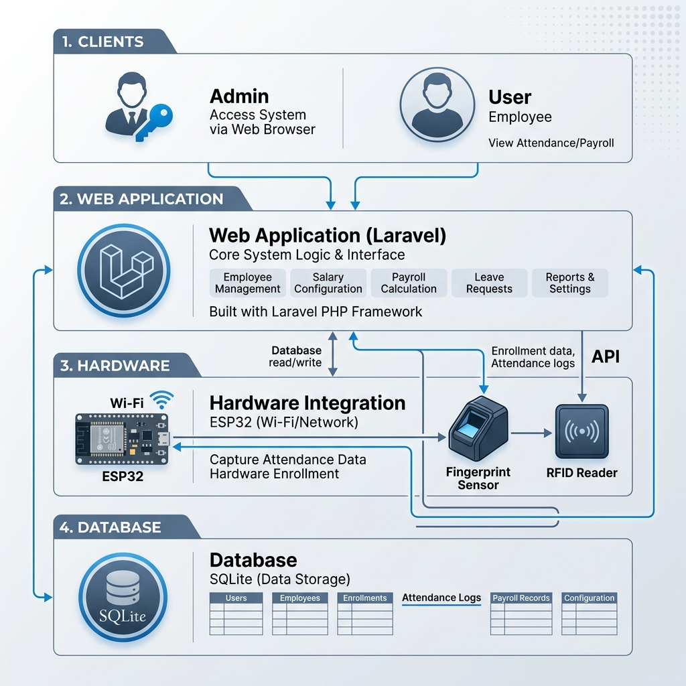

# Biometric Attendance & Payroll System Architecture

This folder contains the official documentation for the system's design and development roadmap.

## 1. System Overview

## 2. Component Breakdown

### Web Application (Laravel)
- **Role Management**: Admin vs User separation.
- **Employee CRUD**: Management of biometric and salary data.
- **API Engine**: Bridge between hardware and database.

### Hardware (ESP32)
- **Sensors**: Fingerprint (AS608/R503) and RFID (RC522).
- **Communication**: Wi-Fi enabled HTTP requests to the Laravel API.

### Database (SQLite)
- **Storage**: Local file-based database for simplicity and speed in development.

## 3. Development Roadmap
1. **Phase 1**: Auth & Roles (Done)
2. **Phase 2**: Employee & Salary Management (Next)
3. **Phase 3**: Hardware Interface
4. **Phase 4**: Scheduling Logic
5. **Phase 5**: Reporting
